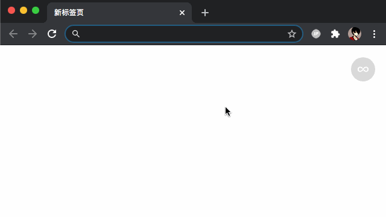

# localhost2ip

A Chrome extension that automatically redirect http://localhost to your internal IP (ipv4).

When using it for the first time, 
this extension will apply for permission to use microphone（ [Why?](https://groups.google.com/forum/#!topic/discuss-webrtc/6stQXi72BEU) ）. 
Please allow it.

输入localhost会自动跳转到本地ip地址。

首次使用时会提示使用麦克风权限（ [Why?](https://groups.google.com/forum/#!topic/discuss-webrtc/6stQXi72BEU) ），请放心允许。

## 更新
FIX: 当网卡启用ipv6后, 插件失效的问题。
